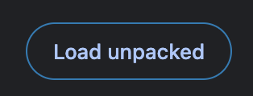
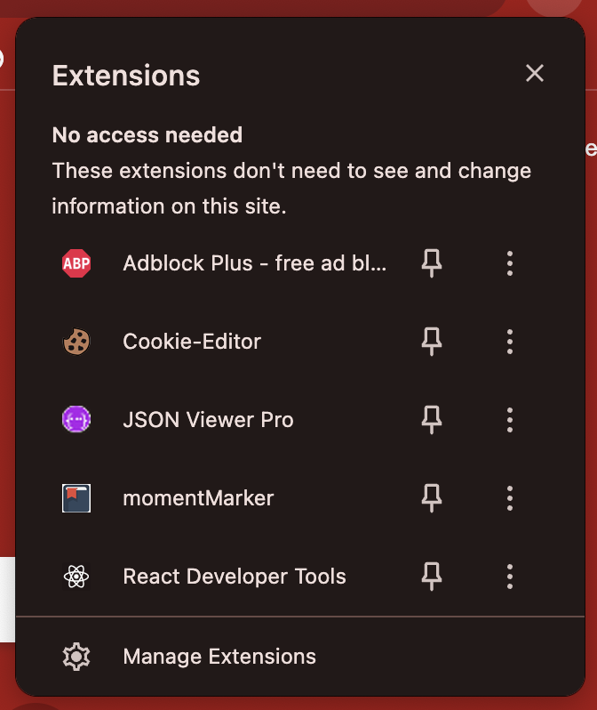

#### Clone this Repository using

```bash
git clone https://github.com/RajMeena01/moment-Marker.git
cd moment-Marker
```

#### Load the Extension in Chrome
1. Open Google Chrome.
2. Go to `chrome://extensions/`.
3. Enable **Developer Mode** by toggling the switch in the top-right corner.
4. Click the **Load unpacked** button as shown below:



5. Select the folder containing the cloned repository.

### Step 3: Confirm the Extension is Loaded
Once loaded, the extension should appear in the list of Chrome extensions. It will look like this:



#### Features
- **Moment Tracking:** Quickly mark important moments and access them later.
- **User-Friendly Interface:** Designed for ease of use.
- **Customizable Settings:** Tailor the extension to your preferences.

## Contributions
Contributions are welcome! Follow these steps:
1. Fork the repository.
2. Create a new branch:
    ```bash
    git checkout -b feature-name
    ```
3. Commit your changes and push to the branch:
    ```bash
    git push origin feature-name
    ```
4. Open a pull request.

## License
See the `LICENSE` file for details

---

### Screenshots
#### Load Unpacked


#### Extensions Panel

```
